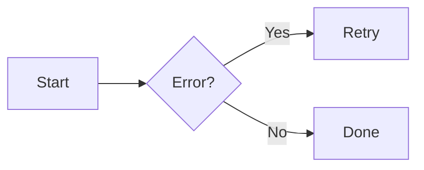

# Authoring Guide

This guide covers how to author documentation for AWS Lambda Durable Functions.
For setup and contribution workflow, see [CONTRIBUTING.md](CONTRIBUTING.md).

Each SDK reference page must be equally useful to TypeScript, Python, and Java
developers. No language is the implicit default. Language-specific quirks
belong inside the relevant tab, not in shared prose.

## Verify Against SDK Source

Before writing or updating any copy or examples, read the actual SDK source
for every language. Do not trust existing docs. Do not guess. Verify every
argument name, type, and return type against the source.

Verify means: check each argument, each type of each argument and return,
find the definition for each of those types, and if those types reference
sub-types, find those too. Recurse until you have the full picture.

For each code example:

1. Find the method definition in the SDK source, not tests or docs
2. For each parameter, find its type definition. Recurse through nested types.
3. For Java, check both the sync and async variants (e.g. `step()` and `stepAsync()`)
4. Check the testing libraries of each repo for examples to verify your example code actually works

### SDK repositories

You will need the SDK source for all three languages. Clone them alongside
the docs repo:

| Repository | Source path to read |
|---|---|
| [aws-durable-execution-sdk-js](https://github.com/aws/aws-durable-execution-sdk-js) | `packages/aws-durable-execution-sdk-js/src` |
| [aws-durable-execution-sdk-python](https://github.com/aws/aws-durable-execution-sdk-python) | `src/aws_durable_execution_sdk_python` |
| [aws-durable-execution-sdk-java](https://github.com/aws/aws-durable-execution-sdk-java) | `sdk/src/main/java/software/amazon/lambda/durable` |

Testing SDKs are useful for confirming example code compiles and runs. The
JavaScript and Java testing SDKs live in the same repos as the main SDKs
(under `-testing` package paths). The Python testing SDK lives in a separate
repo:

| Repository | Source path to read |
|---|---|
| [aws-durable-execution-sdk-python-testing](https://github.com/aws/aws-durable-execution-sdk-python-testing) | `src/aws_durable_execution_sdk_python_testing` |


### Key source files

- **TypeScript**: `types/durable-context.ts` for `DurableContext`. Check
  `types/step.ts`, `types/core.ts`, etc. for referenced types.
- **Python**: `context.py` for `DurableContext`. Check `config.py` for
  `StepConfig` and `StepSemantics`. Check `types.py` for `StepContext`.
- **Java**: `DurableContext.java` for the interface. Check
  `config/StepConfig.java`, `StepContext.java`, `StepSemantics.java`.

## Writing Style

### Voice and Tone

Write for developers who want to learn how to use the SDK. Be direct and
technical. Avoid marketing language ("powerful", "flexible", "seamless").

Don't use unnecessary words. Keep sentences concise.

Use active voice. Write "the SDK checkpoints the result" not "the result is
checkpointed".

Every sentence must earn its place. If a sentence restates what the code
already shows, delete it.

Per Strunk and White, use definite, specific, concrete language. Prefer
the specific to the general, the definite to the vague, the concrete to
the abstract. In practice, avoid 'to be' and 'to have' where you can use
stronger verbs.

### Sentence Structure

Do not use emdash (—) or hyphen as a dash. If you feel tempted to use one,
break it into two sentences or use a comma.

Keep sentences short. One idea per sentence.

### What to Avoid

**Listicles.** Do not create Terminology, Key Features, Best Practices, or
FAQ sections. These are convenient for LLMs but not for humans learning to
code. If you feel tempted to write one, fold the content into prose:

- New terms: introduce the term naturally in the prose where it first appears
- "Key features": drop them (usually marketing), or fold the underlying
  capability into the relevant section
- Best practices: fold the guidance into the section where it applies. A
  naming best practice belongs in the "Naming steps" section, not a generic
  "Best Practices" list.
- FAQ Q&As: each question is either (a) a concept that belongs in prose,
  (b) a code example that belongs in a code section, or (c) something
  already covered elsewhere that doesn't need repeating

**Navigation artifacts.** Do not add Table of Contents, "Back to top" links,
or "Back to X" links. Zensical generates navigation automatically.

**Language-specific notes outside tabs.** Any note that applies to only one
language belongs inside that language's tab, not in shared prose.

### List Items

Do not use emdash or hyphen to separate a list item heading from its
description. Use bold or links instead:

```markdown
- **StepConfig** configures retry behavior and timeouts
- [wait()](operations/wait.md) pauses execution for a duration
```

## Revise, Don't Append

When you update a page, revise the whole section. A fresh reader should not
have to reconcile an opening sentence with a later correction tacked on at
the end.

If your new content qualifies, corrects, or extends something earlier on the
page, rewrite the earlier prose too. Don't leave stale sentences in place
because they were there first.

Signs you are appending instead of revising:

- A new sentence at the end of a paragraph that qualifies an earlier one
- A "Note" or "Update" near the end of a section that contradicts the opening
- Two adjacent paragraphs making overlapping points
- A new code example below an older, now-redundant one

When you spot one in your own edit, rewrite the section so the reader gets
a single, coherent story.

## Look Before You Write

Before writing a new page or section, search the docs for the topic. If
another page already covers it, add to that page instead of creating a
parallel explanation. Readers should get one canonical answer, not two
competing ones.

If you find conflicting information on another page, fix both at once. Don't
leave a contradiction for the next reader to sort out.

This applies equally to new pages and to edits on existing pages. A new
section on an existing page can duplicate content elsewhere just as easily
as a whole new page can.

## Language Neutrality

Tab order is always: **TypeScript → Python → Java**.

If a language has a quirk, note it inside that language's tab:

```markdown
=== "TypeScript"

    Pass `undefined` as the name to omit it.

    ```typescript
    --8<-- "examples/typescript/operations/steps/basic-step.ts"
    ```

=== "Python"

    The `@durable_step` decorator uses the function name automatically.

    ```python
    --8<-- "examples/python/operations/steps/basic-step.py"
    ```

=== "Java"

    The name is always required. Pass `null` to omit it.

    ```java
    --8<-- "examples/java/operations/steps/basic-step.java"
    ```
```

## Page Structure

SDK reference pages follow this pattern:

1. One or two short paragraphs explaining what the operation does and when
   to use it
2. A minimal walkthrough example (tabs, all three languages)
3. Method signature section with per-language tabs
4. Parameters listed after the tabs (shared where identical, inside tabs
   where language-specific)
5. Returns and Throws/Raises after parameters
6. Sub-sections for config types (StepConfig, StepContext, SemanticsEnum)
   each with per-language tabs
7. Conceptual sub-sections as needed (naming, configuration, data passing,
   nesting, concurrency)
8. "See also" at the end

### Exemplar pages

Model tone and structure on these pages:

- [`wait.md`](docs/sdk-reference/operations/wait.md): simple method
- [`step.md`](docs/sdk-reference/operations/step.md): complex method with multiple types
- [`wait-for-condition.md`](docs/sdk-reference/operations/wait-for-condition.md): complex method with multiple types

### Template

```markdown
# {Operation Name}

## {Concept heading — what it does}

{One or two paragraphs. Language-neutral. No listicles.}

{Simple walkthrough example with tabs}

## Method signature

### {method name}

=== "TypeScript"
    {signature}
    **Parameters:**
    - ...
    **Returns:** ...
    **Throws:** ...

=== "Python"
    {signature}
    **Parameters:**
    - ...
    **Returns:** ...
    **Raises:** ...

=== "Java"
    {sync and async signatures}
    **Parameters:**
    - ...
    **Returns:** ...
    **Throws:** ...

### {ConfigType}

{same pattern — interface/dataclass/builder per tab}

### {ContextType}

### {SemanticsEnum}

## The {operation}'s function

### Anonymous {operation} functions

### Pass arguments to the {operation} function

## Naming {operations}

## Configuration

## See also

- [Related page](link)
```

## Code Examples

### Requirements

All code examples must:

- Include all three languages (TypeScript, Python, Java)
- Be functionally equivalent across languages
- Include necessary imports
- Be minimal. Show the concept, not a full application.
- Avoid comments that restate what the code does
- Be verified against the actual SDK source before committing

### File Organization

```
examples/
  typescript/{section}/{subsection}/{example-name}.ts
  python/{section}/{subsection}/{example-name}.py
  java/{section}/{subsection}/{example-name}.java
```

Use hyphens in filenames. All three languages must have the same set of files.

### Embedding in Docs

Use the `--8<--` snippet syntax with content tabs:

```markdown
=== "TypeScript"

    ```typescript
    --8<-- "examples/typescript/operations/steps/basic-step.ts"
    ```

=== "Python"

    ```python
    --8<-- "examples/python/operations/steps/basic-step.py"
    ```

=== "Java"

    ```java
    --8<-- "examples/java/operations/steps/basic-step.java"
    ```
```

### Method Signatures

Show the actual callable signature, not pseudocode. Use real types from the
SDK.

For Java, show both sync and async variants:

```markdown
=== "Java"

    ```java
    // sync
    <T> T step(String name, Class<T> resultType, Function<StepContext, T> func)
    <T> T step(String name, Class<T> resultType, Function<StepContext, T> func, StepConfig config)

    // async
    <T> DurableFuture<T> stepAsync(String name, Class<T> resultType, Function<StepContext, T> func)
    <T> DurableFuture<T> stepAsync(String name, Class<T> resultType, Function<StepContext, T> func, StepConfig config)
    ```
```

For TypeScript, show both overloads if they exist (e.g. named and unnamed).

## Formatting Reference

This project uses [Zensical](https://zensical.org) to build the documentation
site.

### Admonitions

```markdown
!!! note

    This is a note admonition.

!!! warning

    This is a warning admonition.
```

### Collapsible Blocks

```markdown
??? info "Click to expand"

    Hidden content here.
```

### Code Blocks

````markdown
```python hl_lines="2" title="Example"
def greet(name):
    print(f"Hello, {name}!")
```
````

Inline code with syntax highlighting: `` `#!python print("Hello")` ``

### Content Tabs

```markdown
=== "TypeScript"

    ```typescript
    console.log("Hello");
    ```

=== "Python"

    ```python
    print("Hello")
    ```
```

### Diagrams

````markdown

````

### Tables

```markdown
| Parameter | Type | Description |
|-----------|------|-------------|
| name | string | Step identifier |
| config | StepConfig | Optional configuration |
```

## Checklist Before Committing

- [ ] All prose is language-neutral (no Python-only concepts described as universal)
- [ ] No Table of Contents, no "Back to top" links, no "Back to X" links
- [ ] No Terminology, Key Features, Best Practices, or FAQ sections
- [ ] Tab order is TypeScript → Python → Java everywhere
- [ ] Language-specific notes are inside tabs, not outside
- [ ] All three languages have example files for every `--8<--` reference
- [ ] Every example verified against the actual SDK source
- [ ] Java method signatures show both sync and async variants
- [ ] TypeScript signatures show both overloads where they exist
- [ ] No emdash, no hyphen-as-dash
- [ ] No passive voice
- [ ] Updates are revisions, not tacked-on additions
- [ ] Topic is not already covered (or duplicated) on another page
- [ ] No contradictions with other pages
- [ ] Ran `~/.venvs/zensical/bin/mdformat docs/path/to/file.md` on the updated file
- [ ] Previewed with `~/.venvs/zensical/bin/zensical serve`
