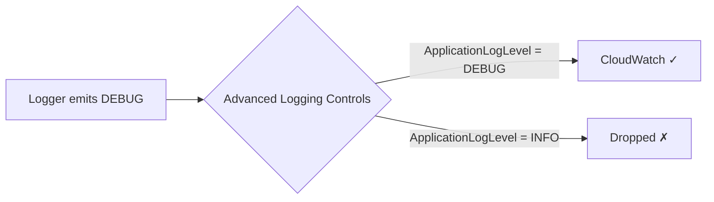

# Logger integration

The Durable Execution SDK automatically enriches your logs with execution context, making it easy to trace operations across checkpoints and replays. You can use the built-in logger or integrate with Powertools for AWS Lambda (Python) for advanced structured logging.

## Table of contents

- [Key features](#key-features)
- [Terminology](#terminology)
- [Getting started](#getting-started)
- [Method signature](#method-signature)
- [Automatic context enrichment](#automatic-context-enrichment)
- [Adding custom metadata](#adding-custom-metadata)
- [Logger inheritance in child contexts](#logger-inheritance-in-child-contexts)
- [Integration with Powertools for AWS Lambda (Python)](#integration-with-powertools-for-aws-lambda-python)
- [Replay behavior and log deduplication](#replay-behavior-and-log-deduplication)
- [Best practices](#best-practices)
- [Enabling debug logging](#enabling-debug-logging)
- [FAQ](#faq)
- [Testing logger integration](#testing-logger-integration)
- [See also](#see-also)

[← Back to main index](../index.md)

## Key features

- Automatic log deduplication during replays - logs from completed operations don't repeat
- Automatic enrichment with execution context (execution ARN, parent ID, operation name, attempt number)
- Logger inheritance in child contexts for hierarchical tracing
- Compatible with Python's standard logging and Powertools for AWS Lambda (Python)
- Support for custom metadata through the `extra` parameter
- All standard log levels: debug, info, warning, error, exception

[↑ Back to top](#table-of-contents)

## Terminology

**Log deduplication** - The SDK prevents duplicate logs during replays by tracking completed operations. When your function is checkpointed and resumed, logs from already-completed operations aren't emitted again, keeping your CloudWatch logs clean.

**Context enrichment** - The automatic addition of execution metadata (execution ARN, parent ID, operation name, attempt number) to log entries. The SDK handles this for you, so every log includes tracing information.

**Logger inheritance** - When you create a child context, it inherits the parent's logger and adds its own context information. This creates a hierarchical logging structure that mirrors your execution flow.

**Extra metadata** - Additional key-value pairs you can add to log entries using the `extra` parameter. These merge with the automatic context enrichment.

[↑ Back to top](#table-of-contents)

## Getting started

Access the logger through `context.logger` in your durable functions:

=== "TypeScript"

    ``` typescript
    --8<-- "examples/typescript/core/logger/basic-usage.ts"
    ```

=== "Python"

    ``` python
    --8<-- "examples/python/core/logger/basic-usage.py"
    ```

=== "Java"

    ``` java
    --8<-- "examples/java/core/logger/basic-usage.java"
    ```


The logger automatically includes execution context in every log entry.

### Integration with Lambda Advanced Log Controls

Durable functions work with Lambda's Advanced Log Controls. You can configure your Lambda function to filter logs by level, which helps reduce CloudWatch Logs costs and noise. When you set a log level filter (like INFO or ERROR), logs below that level are automatically ignored.

For example, if you set your Lambda function's log level to INFO, debug logs won't appear in CloudWatch Logs:

=== "TypeScript"

    ``` typescript
    --8<-- "examples/typescript/core/logger/lambda-log-controls.ts"
    ```

=== "Python"

    ``` python
    --8<-- "examples/python/core/logger/lambda-log-controls.py"
    ```

=== "Java"

    ``` java
    --8<-- "examples/java/core/logger/lambda-log-controls.java"
    ```


Learn more about configuring log levels in the [Lambda Advanced Log Controls documentation](https://docs.aws.amazon.com/lambda/latest/dg/monitoring-cloudwatchlogs.html#monitoring-cloudwatchlogs-advanced).

[↑ Back to top](#table-of-contents)

## Method signature

The logger provides standard logging methods:

=== "TypeScript"

    ``` typescript
    --8<-- "examples/typescript/core/logger/logger-method-signature.ts"
    ```

=== "Python"

    ``` python
    --8<-- "examples/python/core/logger/logger-method-signature.py"
    ```

=== "Java"

    ``` java
    --8<-- "examples/java/core/logger/logger-method-signature.java"
    ```


**Parameters:**
- `msg` (object) - The log message. Can include format placeholders.
- `*args` (object) - Arguments for message formatting.
- `extra` (dict[str, object] | None) - Optional dictionary of additional fields to include in the log entry.

[↑ Back to top](#table-of-contents)

## Automatic context enrichment

The SDK automatically enriches logs with execution metadata:

=== "TypeScript"

    ``` typescript
    --8<-- "examples/typescript/core/logger/automatic-context-enrichment.ts"
    ```

=== "Python"

    ``` python
    --8<-- "examples/python/core/logger/automatic-context-enrichment.py"
    ```

=== "Java"

    ``` java
    --8<-- "examples/java/core/logger/automatic-context-enrichment.java"
    ```


**Enriched fields:**
- `execution_arn` - Always present, identifies the durable execution
- `parent_id` - Present in child contexts, identifies the parent operation
- `name` - Present when the operation has a name
- `attempt` - Present in steps, shows the retry attempt number

[↑ Back to top](#table-of-contents)

## Adding custom metadata

Use the `extra` parameter to add custom fields to your logs:

=== "TypeScript"

    ``` typescript
    --8<-- "examples/typescript/core/logger/add-custom-metadata.ts"
    ```

=== "Python"

    ``` python
    --8<-- "examples/python/core/logger/add-custom-metadata.py"
    ```

=== "Java"

    ``` java
    --8<-- "examples/java/core/logger/add-custom-metadata.java"
    ```


Custom fields merge with the automatic context enrichment, so your logs include both execution metadata and your custom data.

[↑ Back to top](#table-of-contents)

## Logger inheritance in child contexts

Child contexts inherit the parent's logger and add their own context:

=== "TypeScript"

    ``` typescript
    --8<-- "examples/typescript/core/logger/child-workflow.ts"
    ```

=== "Python"

    ``` python
    --8<-- "examples/python/core/logger/child-workflow.py"
    ```

=== "Java"

    ``` java
    --8<-- "examples/java/core/logger/child-workflow.java"
    ```


This creates a hierarchical logging structure where you can trace operations from parent to child contexts.

[↑ Back to top](#table-of-contents)

## Integration with Powertools for AWS Lambda (Python)

The SDK is compatible with Powertools for AWS Lambda (Python), giving you structured logging with JSON output and additional features.

**Powertools for AWS Lambda (Python) benefits:**
- JSON structured logging for CloudWatch Logs Insights
- Automatic Lambda context injection (request ID, function name, etc.)
- Correlation IDs for distributed tracing
- Log sampling for cost optimization
- Integration with X-Ray tracing

### Using Powertools for AWS Lambda (Python) directly

You can use Powertools for AWS Lambda (Python) directly in your durable functions:

=== "TypeScript"

    ``` typescript
    --8<-- "examples/typescript/core/logger/child-workflow.ts"
    ```

=== "Python"

    ``` python
    --8<-- "examples/python/core/logger/child-workflow.py"
    ```

=== "Java"

    ``` java
    --8<-- "examples/java/core/logger/child-workflow.java"
    ```


This gives you all Powertools for AWS Lambda (Python) features like JSON logging and correlation IDs.

### Integrating with context.logger

For better integration with durable execution, set Powertools for AWS Lambda (Python) on the context:

=== "TypeScript"

    ``` typescript
    --8<-- "examples/typescript/core/logger/integrate-powertools-context.ts"
    ```

=== "Python"

    ``` python
    --8<-- "examples/python/core/logger/integrate-powertools-context.py"
    ```

=== "Java"

    ``` java
    --8<-- "examples/java/core/logger/integrate-powertools-context.java"
    ```


**Benefits of using context.logger:**
- All Powertools for AWS Lambda (Python) features (JSON logging, correlation IDs, etc.)
- Automatic SDK context enrichment (execution_arn, parent_id, name, attempt)
- Log deduplication during replays (see next section)

The SDK's context enrichment (execution_arn, parent_id, name, attempt) merges with Powertools for AWS Lambda (Python) fields (service, request_id, function_name, etc.) in the JSON output.

[↑ Back to top](#table-of-contents)

## Replay behavior and log deduplication

A critical feature of `context.logger` is that it prevents duplicate logs during replays. When your durable function is checkpointed and resumed, the SDK replays your code to reach the next operation, but logs from completed operations aren't emitted again.

### How context.logger prevents duplicate logs

When you use `context.logger`, the SDK tracks which operations have completed and suppresses logs during replay:

=== "TypeScript"

    ``` typescript
    --8<-- "examples/typescript/core/logger/context-logger-deduplication.ts"
    ```

=== "Python"

    ``` python
    --8<-- "examples/python/core/logger/context-logger-deduplication.py"
    ```

=== "Java"

    ``` java
    --8<-- "examples/java/core/logger/context-logger-deduplication.java"
    ```


**What happens during replay:**
1. First invocation: All logs appear (starting workflow, step 1 completed, step 2 completed)
2. After checkpoint and resume: Only new logs appear (step 2 completed if step 1 was checkpointed)
3. Your CloudWatch logs show each message only once, making them clean and easy to read

### Logging behavior with direct logger usage

When you use a logger directly (not through `context.logger`), logs will be emitted on every replay:

=== "TypeScript"

    ``` typescript
    --8<-- "examples/typescript/core/logger/direct-logger-duplicates.ts"
    ```

=== "Python"

    ``` python
    --8<-- "examples/python/core/logger/direct-logger-duplicates.py"
    ```

=== "Java"

    ``` java
    --8<-- "examples/java/core/logger/direct-logger-duplicates.java"
    ```


**What happens during replay:**
1. First invocation: All logs appear once
2. After checkpoint and resume: "Starting workflow" and "Step 1 completed" appear again
3. Your CloudWatch logs show duplicate entries for replayed operations

### Using context.logger with Powertools for AWS Lambda (Python)

To get both log deduplication and Powertools for AWS Lambda (Python) features, set the Powertools Logger on the context:

=== "TypeScript"

    ``` typescript
    --8<-- "examples/typescript/core/logger/powertools-with-deduplication.ts"
    ```

=== "Python"

    ``` python
    --8<-- "examples/python/core/logger/powertools-with-deduplication.py"
    ```

=== "Java"

    ``` java
    --8<-- "examples/java/core/logger/powertools-with-deduplication.java"
    ```


**Benefits of this approach:**
- Clean logs without duplicates during replays
- JSON structured logging from Powertools for AWS Lambda (Python)
- Automatic context enrichment from the SDK (execution_arn, parent_id, name, attempt)
- Lambda context injection from Powertools for AWS Lambda (Python) (request_id, function_name, etc.)
- Correlation IDs and X-Ray integration from Powertools for AWS Lambda (Python)

### When you might see duplicate logs

You'll still see duplicate logs in these scenarios:
- Logs from operations that fail and retry (this is expected and helpful for debugging)
- Logs outside of durable execution context (before `@durable_execution` decorator runs)
- Logs from code that runs during replay before reaching a checkpoint

This is normal behavior and helps you understand the execution flow.

[↑ Back to top](#table-of-contents)

## Best practices

**Use structured logging with extra fields**

Add context-specific data through the `extra` parameter rather than embedding it in the message string:

=== "TypeScript"

    ``` typescript
    --8<-- "examples/typescript/core/logger/structured-logging-extra.ts"
    ```

=== "Python"

    ``` python
    --8<-- "examples/python/core/logger/structured-logging-extra.py"
    ```

=== "Java"

    ``` java
    --8<-- "examples/java/core/logger/structured-logging-extra.java"
    ```


**Log at appropriate levels**

- `debug` - Detailed diagnostic information for troubleshooting
- `info` - General informational messages about workflow progress
- `warning` - Unexpected situations that don't prevent execution
- `error` - Error conditions that may need attention
- `exception` - Exceptions with stack traces (use in except blocks)

**Include business context in logs**

Add identifiers that help you trace business operations:

=== "TypeScript"

    ``` typescript
    --8<-- "examples/typescript/core/logger/include-business-context.ts"
    ```

=== "Python"

    ``` python
    --8<-- "examples/python/core/logger/include-business-context.py"
    ```

=== "Java"

    ``` java
    --8<-- "examples/java/core/logger/include-business-context.java"
    ```


**Use Powertools for AWS Lambda (Python) for production**

For production workloads, use Powertools for AWS Lambda (Python) to get JSON structured logging and CloudWatch Logs Insights integration:

=== "TypeScript"

    ``` typescript
    --8<-- "examples/typescript/core/logger/use-powertools-production.ts"
    ```

=== "Python"

    ``` python
    --8<-- "examples/python/core/logger/use-powertools-production.py"
    ```

=== "Java"

    ``` java
    --8<-- "examples/java/core/logger/use-powertools-production.java"
    ```


**Don't log sensitive data**

Avoid logging sensitive information like passwords, tokens, or personal data:

=== "TypeScript"

    ``` typescript
    --8<-- "examples/typescript/core/logger/avoid-sensitive-data.ts"
    ```

=== "Python"

    ``` python
    --8<-- "examples/python/core/logger/avoid-sensitive-data.py"
    ```

=== "Java"

    ``` java
    --8<-- "examples/java/core/logger/avoid-sensitive-data.java"
    ```


[↑ Back to top](#table-of-contents)

## Enabling debug logging

The SDK logs internally using Python's standard `logging` module. To see these logs, set `ApplicationLogLevel: DEBUG` in [Advanced logging controls](https://docs.aws.amazon.com/lambda/latest/dg/monitoring-cloudwatchlogs-advanced.html).

Advanced logging controls filters logs before they reach CloudWatch. If you set DEBUG level in code but leave Advanced logging controls at INFO, your debug logs will be dropped. You must configure the level in Advanced logging controls - it auto-patches all loggers, so you don't need to configure log levels in code.



**Important:** DEBUG level applies to all libraries including botocore. Since the SDK uses boto3 internally, this will flood your logs with HTTP request/response details. Silence botocore in your code:

=== "TypeScript"

    ``` typescript
    --8<-- "examples/typescript/core/logger/silence-botocore.ts"
    ```

=== "Python"

    ``` python
    --8<-- "examples/python/core/logger/silence-botocore.py"
    ```

=== "Java"

    ``` java
    --8<-- "examples/java/core/logger/silence-botocore.java"
    ```


Configure ALC via SAM/CloudFormation:

```yaml
# SAM template
Resources:
  MyFunction:
    Type: AWS::Serverless::Function
    Properties:
      LoggingConfig:
        LogFormat: JSON
        ApplicationLogLevel: DEBUG
```

Or in the Lambda console under Configuration → Monitoring and operations tools → Logging configuration.

### Selective logging

Python loggers are hierarchical. Silencing `aws_durable_execution_sdk_python` silences all SDK modules. To keep some modules at DEBUG while silencing others:

=== "TypeScript"

    ``` typescript
    --8<-- "examples/typescript/core/logger/selective-logging.ts"
    ```

=== "Python"

    ``` python
    --8<-- "examples/python/core/logger/selective-logging.py"
    ```

=== "Java"

    ``` java
    --8<-- "examples/java/core/logger/selective-logging.java"
    ```


SDK logger namespaces:

| Namespace | Description |
|-----------|-------------|
| `aws_durable_execution_sdk_python` | Root - silences all SDK logs |
| `aws_durable_execution_sdk_python.state` | Checkpoint and replay state management |
| `aws_durable_execution_sdk_python.execution` | Durable execution lifecycle |
| `aws_durable_execution_sdk_python.context` | DurableContext operations |
| `aws_durable_execution_sdk_python.lambda_service` | Lambda API calls |
| `aws_durable_execution_sdk_python.serdes` | Serialization/deserialization |
| `aws_durable_execution_sdk_python.concurrency` | Parallel and map execution |
| `aws_durable_execution_sdk_python.operation.step` | Step operations |
| `aws_durable_execution_sdk_python.operation.wait` | Wait operations |
| `aws_durable_execution_sdk_python.operation.invoke` | Invoke operations |
| `aws_durable_execution_sdk_python.operation.child` | Child context operations |
| `aws_durable_execution_sdk_python.operation.parallel` | Parallel operations |
| `aws_durable_execution_sdk_python.operation.map` | Map operations |

[↑ Back to top](#table-of-contents)

## FAQ

**Q: Does logging work during replays?**

Yes, but `context.logger` prevents duplicate logs. When you use `context.logger`, the SDK tracks completed operations and suppresses their logs during replay. This keeps your CloudWatch logs clean and easy to read. If you use a logger directly (not through `context.logger`), you'll see duplicate log entries on every replay.

**Q: How do I filter logs by execution?**

Use the `execution_arn` field that's automatically added to every log entry. In CloudWatch Logs Insights:

```
fields @timestamp, @message, execution_arn
| filter execution_arn = "arn:aws:lambda:us-east-1:123456789012:function:my-function:execution-id"
| sort @timestamp asc
```

**Q: Can I use a custom logger?**

Yes. Any logger that implements the `LoggerInterface` protocol works with the SDK. Use `context.set_logger()` to set your custom logger.

The protocol is defined in `aws_durable_execution_sdk_python.types`:

=== "TypeScript"

    ``` typescript
    --8<-- "examples/typescript/core/logger/logger-interface-protocol.ts"
    ```

=== "Python"

    ``` python
    --8<-- "examples/python/core/logger/logger-interface-protocol.py"
    ```

=== "Java"

    ``` java
    --8<-- "examples/java/core/logger/logger-interface-protocol.java"
    ```


Any logger with these methods (like Python's standard `logging.Logger` or Powertools Logger) is compatible.

**Q: What's the difference between the SDK logger and Powertools for AWS Lambda (Python)?**

The SDK provides a logger wrapper that adds execution context. Powertools for AWS Lambda (Python) provides structured JSON logging and Lambda-specific features. You can use them together - set the Powertools Logger on the context, and the SDK will enrich it with execution metadata.

**Q: Do child contexts get their own logger?**

Child contexts inherit the parent's logger and add their own `parent_id` to the context. This creates a hierarchical logging structure where you can trace operations from parent to child.

**Q: How do I change the log level?**

If using Python's standard logging, configure it before your handler:

=== "TypeScript"

    ``` typescript
    --8<-- "examples/typescript/core/logger/set-standard-log-level.ts"
    ```

=== "Python"

    ``` python
    --8<-- "examples/python/core/logger/set-standard-log-level.py"
    ```

=== "Java"

    ``` java
    --8<-- "examples/java/core/logger/set-standard-log-level.java"
    ```


If using Powertools for AWS Lambda (Python), set the level when creating the logger:

=== "TypeScript"

    ``` typescript
    --8<-- "examples/typescript/core/logger/set-powertools-log-level.ts"
    ```

=== "Python"

    ``` python
    --8<-- "examples/python/core/logger/set-powertools-log-level.py"
    ```

=== "Java"

    ``` java
    --8<-- "examples/java/core/logger/set-powertools-log-level.java"
    ```


**Q: Can I access the underlying logger?**

Yes. Use `context.logger.get_logger()` to access the underlying logger instance if you need to call methods not in the `LoggerInterface`.

[↑ Back to top](#table-of-contents)

## Testing logger integration

You can verify that your durable functions log correctly by capturing log output in tests.

### Example test

=== "TypeScript"

    ``` typescript
    --8<-- "examples/typescript/core/logger/test-basic-logger.ts"
    ```

=== "Python"

    ``` python
    --8<-- "examples/python/core/logger/test-basic-logger.py"
    ```

=== "Java"

    ``` java
    --8<-- "examples/java/core/logger/test-basic-logger.java"
    ```


### Verifying log output

To verify specific log messages, capture log output using Python's logging test utilities:

=== "TypeScript"

    ``` typescript
    --8<-- "examples/typescript/core/logger/test-verify-log-output.ts"
    ```

=== "Python"

    ``` python
    --8<-- "examples/python/core/logger/test-verify-log-output.py"
    ```

=== "Java"

    ``` java
    --8<-- "examples/java/core/logger/test-verify-log-output.java"
    ```


### Testing with Powertools for AWS Lambda (Python)

When testing with Powertools for AWS Lambda (Python), you can verify structured log output:

=== "TypeScript"

    ``` typescript
    --8<-- "examples/typescript/core/logger/test-with-powertools.ts"
    ```

=== "Python"

    ``` python
    --8<-- "examples/python/core/logger/test-with-powertools.py"
    ```

=== "Java"

    ``` java
    --8<-- "examples/java/core/logger/test-with-powertools.java"
    ```


[↑ Back to top](#table-of-contents)

## See also

- [Steps](steps.md) - Learn about step operations that use logger enrichment
- [Child contexts](child-contexts.md) - Understand logger inheritance in nested contexts
- [Getting started](../getting-started.md) - Basic durable function setup
- [Powertools for AWS Lambda (Python) - Logger](https://docs.powertools.aws.dev/lambda/python/latest/core/logger/) - Powertools Logger documentation

[↑ Back to top](#table-of-contents)

## License

See the LICENSE file for our project's licensing.

[↑ Back to top](#table-of-contents)
