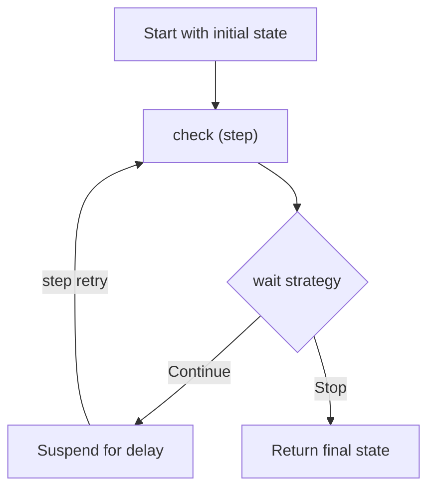

# Wait for Condition

## Wait on a condition with polling

The Wait for Condition operation polls a check function on a schedule until your code
signals it to stop. Behind the scenes, the check condition runs as a
[durable step](steps.md), and each polling attempt is a retry, so the SDK checkpoints
results automatically and tracks state between attempts. The function suspends between
attempts and does not consume Lambda execution time.

It manages the entire poll-wait-check cycle for you, including state tracking, backoff,
and attempt counting.

Use `waitForCondition` when you need to poll until a condition is met. For example, if
you need to poll an external system until something changes, like a batch job
completing, a resource becoming available, or a status reaching a terminal state.

If the external system will send a notification or response, use
[Callbacks](callbacks.md) instead to suspend the durable function until it receives the
response.

## Walkthrough

Here's a simple example that polls until a job completes:

=== "TypeScript"

    ```typescript
    --8<-- "examples/typescript/core/wait/wait-for-condition.ts"
    ```

=== "Python"

    ```python
    --8<-- "examples/python/core/wait/wait-for-condition.py"
    ```

=== "Java"

    ```java
    --8<-- "examples/java/core/wait/wait-for-condition.java"
    ```



## Method signature

=== "TypeScript"

    ```typescript
    --8<-- "examples/typescript/core/wait/wait-for-condition-signature.ts"
    ```

=== "Python"

    ```python
    --8<-- "examples/python/core/wait/wait-for-condition-signature.py"
    ```

=== "Java"

    ```java
    --8<-- "examples/java/core/wait/wait-for-condition-signature.java"
    ```

**Parameters:**

- `name` (optional) - Only used for display, debugging and testing.
- `check` (required) - A function that performs a status check. The check function runs
    as a durable step and each subsequent polling attempt is a retry, so avoid heavy
    computation or side effects and keep it focused on querying status.
- `config` - A configuration object containing:
    - `initialState` - The state object passed to the first check invocation
    - `waitStrategy` - A [Wait strategy](#wait-strategies) to control polling behavior

**Returns:** The final state object from the last check function invocation.

## Wait strategies

The wait strategy controls how long to wait between polling attempts and when to stop
polling. You can write your own custom strategy from scratch, or you can use the
strategy builder helper to create a strategy for you based on configuration values you
provide.

### Wait strategy signature

=== "TypeScript"

    ```typescript
    --8<-- "examples/typescript/core/wait/wait-strategy-signature.ts"
    ```

=== "Python"

    ```python
    --8<-- "examples/python/core/wait/wait-strategy-signature.py"
    ```

=== "Java"

    ```java
    --8<-- "examples/java/core/wait/wait-strategy-signature.java"
    ```

### Custom strategy

Write your own strategy function for full control over polling behavior. The function
receives the current state and attempt number. The strategy function decides whether to
continue polling or not.

=== "TypeScript"

    ```typescript
    --8<-- "examples/typescript/core/wait/custom-strategy.ts"
    ```

=== "Python"

    ```python
    --8<-- "examples/python/core/wait/custom-strategy.py"
    ```

=== "Java"

    In Java, the stop/continue decision lives in the check function (via
    `WaitForConditionResult`). The strategy only computes the delay.

    ```java
    --8<-- "examples/java/core/wait/custom-strategy.java"
    ```

To stop polling and signal an error, throw an exception from the strategy or the check
function.

### Strategy builder helper

Use the ready-made wait strategy helper to generate a strategy function from common
parameters like backoff rate, max attempts, and jitter. This is a convenience so you can
re-use common wait strategy logic without having to code your own function.

=== "TypeScript"

    ```typescript
    --8<-- "examples/typescript/core/wait/strategy-helper.ts"
    ```

=== "Python"

    ```python
    --8<-- "examples/python/core/wait/strategy-helper.py"
    ```

=== "Java"

    ```java
    --8<-- "examples/java/core/wait/strategy-helper.java"
    ```

**Helper parameters:**

- `shouldContinuePolling` - Predicate that returns `true` to keep polling or `false` to
    stop
- `maxAttempts` - Maximum polling attempts. Set this to prevent runaway executions.
    Defaults to 60
- `initialDelay` - Delay before the first retry. Defaults to 5 seconds
- `maxDelay` - Maximum delay between attempts. Defaults to 5 minutes
- `backoffRate` - Multiplier applied to the delay after each attempt (e.g., `2.0`
    doubles the delay). Defaults to 1.5
- `jitter` - Jitter strategy (`FULL`, `HALF`, or `NONE`). Defaults to `FULL`

Delays between attempts are approximate. The actual time depends on system scheduling,
Lambda cold start time, and current system load.

## See also

- [Wait operations](wait.md) - Simple time-based delays
- [Callbacks](callbacks.md) - Wait for external system responses
- [Steps](steps.md) - Execute business logic with automatic checkpointing
- [Getting Started](../getting-started.md) - Learn the basics of durable functions
