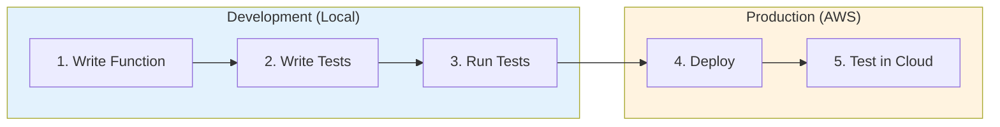

# Development Environment

## Development workflow

```mermaid
flowchart LR
    subgraph dev["Development (Local)"]
        direction LR
        A["1. Write Function"]
        B["2. Write Tests"]
        C["3. Run Tests"]
    end
    
    subgraph prod["Production (AWS)"]
        direction LR
        D["4. Deploy"]
        E["5. Test in Cloud"]
    end
    
    A --> B --> C --> D --> E
    
    style dev fill:#e3f2fd
    style prod fill:#fff3e0
```

