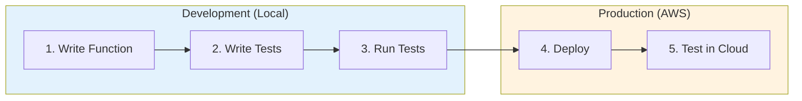

# Development Environment

This page covers the day-to-day workflow for building durable functions: scaffolding a
project, writing and testing the function locally, and deploying it. It uses the
[AWS SAM CLI](https://docs.aws.amazon.com/serverless-application-model/) for the local
development loop (`sam init` to start, `sam local invoke` to run, and `sam deploy` to
ship) and the [AWS CDK](https://docs.aws.amazon.com/cdk/) when you productionize the
surrounding infrastructure. It also covers the AI agent (Kiro Power) the team ships for
building durable functions.

If you just want to deploy your first function with the AWS CLI, start with the
[Quickstart](quickstart.md). This page is about the day-to-day workflow after that.

## Development workflow

You develop durable functions in a tight local loop: write the function, write tests,
and run them locally before you deploy. Once deployed, you run the same tests against
the deployed function to validate packaging and runtime configuration.



The local runner replays your handler in-process, so you catch bugs in
milliseconds instead of waiting on a deploy. See [Testing](../testing/index.md) for the
full workflow.

## Prerequisites

- An AWS account and the [AWS CLI](https://docs.aws.amazon.com/cli/) (2.33.22 or later)
    configured with credentials. Verify with `aws sts get-caller-identity`.
- A language runtime (see the tabs below).
- The [AWS SAM CLI](https://docs.aws.amazon.com/serverless-application-model/) (1.153.1
    or later), used throughout this guide to scaffold, test, and deploy. Version 1.153.1
    is the minimum that recognizes the `DurableConfig` property. Earlier versions fail at
    `sam validate` and `sam build` with "property DurableConfig not defined". The
    [AWS CDK](https://docs.aws.amazon.com/cdk/) (2.237.1 or later) is recommended once you
    productionize the surrounding infrastructure. Direct AWS CLI access also works.

## 1. Write Function

Scaffold a new durable application with `sam init`. Its AWS Quick Start templates include
durable-function starters for TypeScript, Python, and Java that generate the handler, a
`template.yaml` with `DurableConfig` already set, a `tests` folder, and the SDK
dependency:

```console
sam init
```

Choose **AWS Quick Start Templates**, pick the durable function template, then select your
runtime. See
[Create your application in AWS SAM](https://docs.aws.amazon.com/serverless-application-model/latest/developerguide/using-sam-cli-init.html)
for the interactive flow, and the [Quickstart](quickstart.md) for the full handler code in
each language.

Bundle the SDK with your function code so you control the exact version, rather than
relying on the Lambda runtime-provided copy. This gives you control over which version of the
SDK is being deployed in your function code, rather than relying on which is being bundled in the lambda runtime.

=== "TypeScript"

    Requires Node.js 22+.

    ```console
    npm install @aws/durable-execution-sdk-js
    ```

=== "Python"

    Requires Python 3.13+ (3.11 is the minimum the SDK supports; runtimes 3.13+ ship
    the SDK pre-installed).

    ```console
    pip install aws-durable-execution-sdk-python
    ```

=== "Java"

    Requires Java 17+ and Maven 3.8+. Add to your `pom.xml`:

    ```xml
    <dependency>
        <groupId>software.amazon.lambda.durable</groupId>
        <artifactId>aws-durable-execution-sdk-java</artifactId>
        <version>1.1.0</version>
    </dependency>
    ```

=== "C#"

    Requires the .NET 10 SDK.

    ```console
    dotnet add package Amazon.Lambda.DurableExecution
    ```

## 2. Write Tests

Drive your handler with the testing SDK. The runner executes the handler through the
same replay-and-checkpoint loop the Lambda service uses, so local behavior matches the
cloud. TypeScript, Java, and C# ship a `LocalDurableTestRunner`; Python uses
`DurableFunctionTestRunner`.

The runner ships in a separate, dev-only testing package. Install it before you write
tests (see [Authoring tests](../testing/authoring.md) for the full testing workflow):

=== "TypeScript"

    ```console
    npm install --save-dev @aws/durable-execution-sdk-js-testing
    ```

    The testing package's peer range can lag the runtime SDK. If `npm install` reports an
    `ERESOLVE` error, pin the runtime SDK to a version the peer range allows (for example
    `npm install @aws/durable-execution-sdk-js@2.1.0`).

=== "Python"

    ```console
    pip install aws-durable-execution-sdk-python-testing
    ```

=== "Java"

    Add the testing dependency to your `pom.xml` with `test` scope:

    ```xml
    <dependency>
        <groupId>software.amazon.lambda</groupId>
        <artifactId>aws-durable-execution-sdk-java-testing</artifactId>
        <scope>test</scope>
    </dependency>
    ```

=== "C#"

    ```console
    dotnet add package Amazon.Lambda.DurableExecution.Testing
    ```

A minimal test creates a runner with your handler, runs it, and asserts on the result:

=== "TypeScript"

    ```typescript
    --8<-- "examples/typescript/testing/authoring/minimal-test.ts"
    ```

=== "Python"

    ```python
    --8<-- "examples/python/testing/authoring/minimal-test.py"
    ```

=== "Java"

    ```java
    --8<-- "examples/java/testing/authoring/minimal-test.java"
    ```

=== "C#"

    ```csharp
    --8<-- "examples/csharp/testing/authoring/minimal-test.cs"
    ```

To drive an input-based handler, pass an event to the runner:

=== "TypeScript"

    ```typescript
    await runner.run({ payload: { orderId: "A-1" } });
    ```

=== "Python"

    ```python
    runner.run(input='{"orderId": "A-1"}')
    ```

=== "Java"

    ```java
    runner.runUntilComplete(input);
    ```

=== "C#"

    ```csharp
    await runner.RunAsync(input);
    ```

## 3. Run Tests

Run the suite with your language's test runner:

=== "TypeScript"

    ```console
    npm test
    ```

=== "Python"

    ```console
    pytest
    ```

=== "Java"

    ```console
    mvn test
    ```

=== "C#"

    ```console
    dotnet test
    ```

Get operations by name (never by index) and invoke the runner more than once to assert
replay behavior. The [Testing](../testing/index.md) section covers installing the testing
SDK, [authoring tests](../testing/authoring.md), [assertions](../testing/assertions.md),
and [workflow patterns](../testing/workflow-patterns.md).

## 4. Deploy

You can only set the `DurableConfig` at function creation time, not on a later update.
Every durable function needs three things, whichever tool you deploy with:

1. A `DurableConfig` on the function (`ExecutionTimeout` is required;
    `RetentionPeriodInDays` is optional). See the
    [durable configuration reference](https://docs.aws.amazon.com/lambda/latest/dg/durable-configuration.html).
1. The
    [AWSLambdaBasicDurableExecutionRolePolicy](https://docs.aws.amazon.com/aws-managed-policy/latest/reference/AWSLambdaBasicDurableExecutionRolePolicy.html)
    managed policy on the execution role, which grants the checkpoint permissions.
1. A qualified ARN (a published version or an alias) to invoke. Durable execution is not
    supported on an unqualified function name.

Deploy with SAM while you iterate: it declares your function configuration, IAM role,
version, and alias in a single `template.yaml`, one place you can check into source
control, and pairs with the `sam local invoke` / `sam deploy` loop. When you productionize
(composing the function with the rest of your infrastructure, such as queues, tables,
alarms, and multi-environment stages), AWS CDK gives you a typed, programmable app. Tune
`DurableConfig` per environment: short timeouts and retention in development, longer values
in production.

=== "SAM (iterate)"

    `template.yaml`:

    ```yaml
    AWSTemplateFormatVersion: '2010-09-09'
    Transform: AWS::Serverless-2016-10-31

    Resources:
      DurableFunction:
        Type: AWS::Serverless::Function
        Properties:
          Runtime: nodejs22.x
          Handler: index.handler
          CodeUri: ./src
          DurableConfig:
            ExecutionTimeout: 3600
            RetentionPeriodInDays: 7
          Policies:
            - arn:aws:iam::aws:policy/service-role/AWSLambdaBasicDurableExecutionRolePolicy
          AutoPublishAlias: prod

    Outputs:
      AliasArn:
        Value: !Ref DurableFunction.Alias
    ```

    Deploy:

    ```console
    sam build
    sam deploy --guided
    ```

    `AutoPublishAlias` gives you the qualified ARN (the `prod` alias) that durable
    invocation requires.

    `sam build` prepares your handler before packaging. What it needs depends on the
    language:

    === "TypeScript"

        Add an esbuild build method so `sam build` transpiles TypeScript. Without it, SAM
        ships the `.ts` source, which only works for plain JavaScript:

        ```yaml
        DurableFunction:
          Type: AWS::Serverless::Function
          # Properties as above
          Metadata:
            BuildMethod: esbuild
            BuildProperties:
              Format: cjs
              Target: node22
              EntryPoints:
                - index.ts
        ```

    === "Python"

        No build method is required. `sam build` installs dependencies from
        `requirements.txt` and packages the source.

    === "Java"

        `sam build` builds with Maven or Gradle from your `pom.xml` or `build.gradle`.

    === "C#"

        `sam build` builds with the .NET CLI.

=== "CDK (productionize)"

    ```typescript
    import * as cdk from 'aws-cdk-lib';
    import * as lambda from 'aws-cdk-lib/aws-lambda';

    export class DurableFunctionStack extends cdk.Stack {
      constructor(scope: cdk.App, id: string, props?: cdk.StackProps) {
        super(scope, id, props);

        const fn = new lambda.Function(this, 'DurableFunction', {
          runtime: lambda.Runtime.NODEJS_22_X,
          handler: 'index.handler',
          code: lambda.Code.fromAsset('lambda'),
          durableConfig: {
            executionTimeout: cdk.Duration.hours(1),
            retentionPeriod: cdk.Duration.days(7),
          },
        });

        // CDK adds the checkpoint permissions automatically when durableConfig is set.
        const alias = new lambda.Alias(this, 'ProdAlias', {
          aliasName: 'prod',
          version: fn.currentVersion,
        });

        new cdk.CfnOutput(this, 'AliasArn', { value: alias.functionArn });
      }
    }
    ```

    Deploy:

    ```console
    cdk deploy
    ```

You can also use CloudFormation directly (`AWS::Lambda::Function` with a `DurableConfig`
property). For durable invokes, callbacks, multi-environment stages, and log-group
management, see the deployment guidance in the
[Kiro Power](#agentic-development-with-kiro) below.

## 5. Test in Cloud

After deploying, validate using Lambda in the cloud.

- Run your test suite against the deployed function with the
    [Cloud Runner](../testing/cloud-runner.md).

- Invoke locally in a container, or against the deployed function, with the
    [SAM CLI](../testing/sam-cli.md):

    ```console
    # Local container invoke (no deployment needed)
    sam local invoke MyDurableFunction --durable-execution-name my-test

    # Remote invoke against a deployed function
    sam remote invoke MyDurableFunction --stack-name my-stack --event '{"name": "world"}'
    ```

## Agentic development with Kiro

The [Kiro](https://kiro.dev) Power for
**AWS Lambda durable functions** helps your AI coding assistant understand the replay model,
step and wait patterns, error handling, testing, and IaC for durable functions. It is
the fastest way to write correct durable functions with an agent, because it front-loads
the determinism rules that are easy to get wrong.

Install it from [kiro.dev/powers](https://kiro.dev/powers) or from your IDE, then
build workflows from natural language prompts:

```
Help me create a durable Lambda function that processes orders with retries
```

Kiro loads the relevant guidance and walks through the handler, steps with retry
strategies, error handling, tests with the local runner, and deployment. Mentioning
keywords such as `durable`, `workflow`, `saga`, `agentic`, `human-in-the-loop`, or
`callback` activates the Power automatically.

If you use another AI assistant, the same guidance is available as Markdown steering
files in the
[aws-lambda-durable-functions-power](https://github.com/aws/aws-durable-execution-docs/tree/main/aws-lambda-durable-functions-power)
directory of this repository. You can load these files as context to get the same replay-model and
deployment rules.

## Next steps

- [Quickstart](quickstart.md) deploy your first durable function with the AWS CLI
- [Key Concepts](key-concepts.md) replay, checkpoints, and determinism
- [Testing](../testing/index.md) the runner, authoring tests, and assertions
- [Configuration](../sdk-reference/configuration/index.md) `DurableConfig` and the
    Lambda client
- [Manage Executions](manage-executions.md) list, inspect, stop, and clean up
