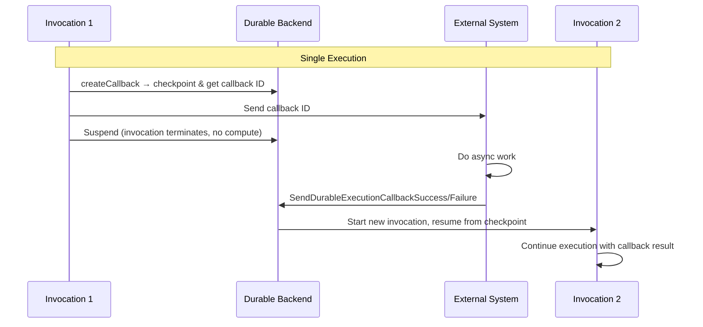

# Callback

## Wait for external systems

A callback suspends a durable function and waits for an external system to provide
input. When you create a callback, the SDK checkpoints the operation and returns a
unique callback ID. After you send the callback ID to an external system, the SDK
suspends the durable function and terminates the current invocation. The function does
not incur compute charges while suspended.

External systems [send callback results](#send-callback-results) using the
`SendDurableExecutionCallbackSuccess` or `SendDurableExecutionCallbackFailure` Lambda
APIs.

When the external system calls back with the ID, the backend starts a new invocation to
resume your function from where it suspended.

Use callbacks when you need to pause execution until a human approves a request, or a
payment processor confirms a transaction, or any other external system completes work
asynchronously. The SDK provides two ways to work with callbacks, either create a
callback and manage the external system notification and wait yourself, or use
`waitForCallback` to handle submission and waiting in one operation.

The SDK provides two operations for working with callbacks.

### Create Callback

Create a callback and return a callback ID along with a handle to wait for the result.
The wait does not consume compute.

You send the callback ID to an external system. The external system uses that ID to
[send callback results](#send-callback-results) using the Lambda API.

=== "TypeScript"

    ```typescript
    --8<-- "examples/typescript/operations/callbacks/basic-example.ts"
    ```

=== "Python"

    ```python
    --8<-- "examples/python/operations/callbacks/basic-example.py"
    ```

=== "Java"

    ```java
    --8<-- "examples/java/operations/callbacks/basic-example.java"
    ```

### Wait for Callback

Wait for Callback combines callback creation, submission, and waiting for the result in
one operation.

Internally the SDK creates a child context containing a
[create callback](#create-callback) operation followed by a step that runs the submitter
function and then waits for the result.

=== "TypeScript"

    ```typescript
    --8<-- "examples/typescript/operations/callbacks/wait-for-callback-example.ts"
    ```

=== "Python"

    ```python
    --8<-- "examples/python/operations/callbacks/wait-for-callback-example.py"
    ```

=== "Java"

    ```java
    --8<-- "examples/java/operations/callbacks/wait-for-callback-example.java"
    ```

### Callback lifecycle

A callback spans multiple invocations within a single execution.



- **Function** The durable Lambda function. This contains your code.
- **Execution** The complete end-to-end lifecycle of an AWS Lambda durable function
- **Invocation** A single invocation of the function during the over-all execution. The
    invocation terminates at a callback wait. The backend re-invokes the function when
    the callback resolves, and [replays](../../getting-started/key-concepts/#replay) to
    resume at the callback wait point with the result.

## Method signatures

### createCallback

=== "TypeScript"

    ```typescript
    --8<-- "examples/typescript/operations/callbacks/create-callback-signature.ts"
    ```

    **Parameters:**

    - `name` (optional) A name for the callback. Pass `undefined` to omit.
    - `config` (optional) A `CreateCallbackConfig<TOutput>` object.

    **Returns:** `DurablePromise<[DurablePromise<TOutput>, string]>`. Destructure with
    `await` to get `[callbackPromise, callbackId]`. Await `callbackPromise` to suspend until
    the external system calls back.

    **Throws:** `CallbackError` if the callback fails, times out, or the external system
    reports failure. The error is thrown by `callbackPromise`, not by `createCallback`
    itself.

=== "Python"

    ```python
    --8<-- "examples/python/operations/callbacks/create-callback-signature.py"
    ```

    **Parameters:**

    - `name` (optional) A name for the callback.
    - `config` (optional) A `CallbackConfig` object.

    **Returns:** A `Callback` object. Access `callback.callback_id` to get the ID to send to
    the external system. Call `callback.result()` to suspend until the external system calls
    back.

    **Raises:** `CallbackError` from `callback.result()` if the callback fails or times out.

=== "Java"

    ```java
    --8<-- "examples/java/operations/callbacks/create-callback-signature.java"
    ```

    **Parameters:**

    - `name` (required) A name for the callback.
    - `resultType` The `Class<T>` or `TypeToken<T>` for deserialization.
    - `config` (optional) A `CallbackConfig` object.

    **Returns:** `DurableCallbackFuture<T>`. Call `callback.callbackId()` to get the ID to
    send to the external system. Call `callback.get()` to suspend until the external system
    calls back.

    **Throws:** `CallbackFailedException` if the external system reports failure.
    `CallbackTimeoutException` if the callback times out.

### Callback Handle

The object returned by `createCallback`.

=== "TypeScript"

    `[callbackPromise, callbackId]` — a tuple destructured from the awaited result.

    - `callbackId` (`string`) The unique ID to send to the external system.
    - `callbackPromise` (`DurablePromise<TOutput>`) Await to suspend until the external
        system calls back.

=== "Python"

    ```python
    class Callback:
        callback_id: str
        def result(self) -> T | None: ...
    ```

    - `callback_id` The unique ID to send to the external system.
    - `result()` Suspends until the external system calls back. Raises `CallbackError` if
        the callback fails or times out.

=== "Java"

    ```java
    interface DurableCallbackFuture<T> extends DurableFuture<T> {
        String callbackId();
        T get();
    }
    ```

    - `callbackId()` The unique ID to send to the external system.
    - `get()` Blocks until the external system calls back. Throws `CallbackFailedException`
        or `CallbackTimeoutException` on failure.

### CallbackConfig

=== "TypeScript"

    ```typescript
    interface CreateCallbackConfig<TOutput = string> {
      timeout?: Duration;
      heartbeatTimeout?: Duration;
      serdes?: Omit<Serdes<TOutput>, "serialize">;
    }
    ```

    **Parameters:**

    - `timeout` (optional) Maximum time to wait for the callback result. See
        [Duration](wait.md#duration) for how to specify durations.
    - `heartbeatTimeout` (optional) Maximum time between heartbeat signals from the external
        system. If the external system does not send a heartbeat within this interval, the
        callback fails.
    - `serdes` (optional) Custom deserializer for the callback result. See
        [Serialization](../state/serialization.md).

=== "Python"

    ```python
    @dataclass(frozen=True)
    class CallbackConfig:
        timeout: Duration = Duration()
        heartbeat_timeout: Duration = Duration()
        serdes: SerDes | None = None
    ```

    **Parameters:**

    - `timeout` (optional) Maximum time to wait for the callback result. See
        [Duration](wait.md#duration) for how to specify durations.
    - `heartbeat_timeout` (optional) Maximum time between heartbeat signals from the
        external system. If the external system does not send a heartbeat within this
        interval, the callback fails.
    - `serdes` (optional) Custom `SerDes` for the callback result. See
        [Serialization](../state/serialization.md).

=== "Java"

    ```java
    CallbackConfig.builder()
        .timeout(Duration)          // optional
        .heartbeatTimeout(Duration) // optional
        .serDes(SerDes)             // optional
        .build()
    ```

    **Parameters:**

    - `timeout` (optional) Maximum time to wait for the callback result. Uses
        `java.time.Duration`.
    - `heartbeatTimeout` (optional) Maximum time between heartbeat signals from the external
        system. If the external system does not send a heartbeat within this interval, the
        callback fails.
    - `serDes` (optional) Custom `SerDes` for the callback result. See
        [Serialization](../state/serialization.md).

### waitForCallback

`waitForCallback` is a composite operation that combines `createCallback` with a step
that runs your submitter function. The submitter receives the callback ID and is
responsible for sending it to the external system. If the submitter fails, the SDK
retries it according to the step's retry strategy.

The external system [sends callback results](#send-callback-results) using the
`SendDurableExecutionCallbackSuccess` or `SendDurableExecutionCallbackFailure` Lambda
APIs.

Use `waitForCallback` when you want the SDK to handle the retry logic for submitting the
callback ID rather than coding it yourself.

=== "TypeScript"

    ```typescript
    --8<-- "examples/typescript/operations/callbacks/wait-for-callback-signature.ts"
    ```

    **Parameters:**

    - `name` (optional) A name for the operation. Pass `undefined` to omit.
    - `submitter` A function that receives the callback ID and a `WaitForCallbackContext`,
        and submits the ID to the external system.
    - `config` (optional) A `WaitForCallbackConfig<TOutput>` object.

    **Returns:** `DurablePromise<TOutput>`. Await to get the callback result.

    **Throws:** `CallbackError` if the callback fails, times out, or the external system
    reports failure.

=== "Python"

    ```python
    --8<-- "examples/python/operations/callbacks/wait-for-callback-signature.py"
    ```

    **Parameters:**

    - `submitter` A callable that receives the callback ID and a `WaitForCallbackContext`,
        and submits the ID to the external system.
    - `name` (optional) A name for the operation.
    - `config` (optional) A `WaitForCallbackConfig` object.

    **Returns:** The callback result.

    **Raises:** `CallbackError` if the callback fails or times out.

=== "Java"

    ```java
    --8<-- "examples/java/operations/callbacks/wait-for-callback-signature.java"
    ```

    **Parameters:**

    - `name` (required) A nullable name for the operation.
    - `resultType` The `Class<T>` or `TypeToken<T>` for deserialization.
    - `func` A `BiConsumer<String, StepContext>` that receives the callback ID and submits
        it to the external system.
    - `config` (optional) A `WaitForCallbackConfig` object.

    **Returns:** `T` (sync) or `DurableFuture<T>` (async via `waitForCallbackAsync()`).

    **Throws:** `CallbackFailedException` if the external system reports failure.
    `CallbackTimeoutException` if the callback times out. `CallbackSubmitterException` if
    the submitter step fails after exhausting retries.

### WaitForCallbackConfig

`WaitForCallbackConfig` extends `CallbackConfig` with retry configuration for the
submitter step.

=== "TypeScript"

    ```typescript
    interface WaitForCallbackConfig<TOutput = string> {
      timeout?: Duration;
      heartbeatTimeout?: Duration;
      retryStrategy?: (error: Error, attemptCount: number) => RetryDecision;
      serdes?: Omit<Serdes<TOutput>, "serialize">;
    }
    ```

    - `retryStrategy` (optional) A function returning a `RetryDecision` for the submitter
        step. See [Retry strategies](../error-handling/retries.md).

=== "Python"

    ```python
    @dataclass(frozen=True)
    class WaitForCallbackConfig(CallbackConfig):
        retry_strategy: Callable[[Exception, int], RetryDecision] | None = None
    ```

    - `retry_strategy` (optional) A callable returning a `RetryDecision` for the submitter
        step. See [Retry strategies](../error-handling/retries.md).

=== "Java"

    ```java
    WaitForCallbackConfig.builder()
        .stepConfig(StepConfig)       // optional
        .callbackConfig(CallbackConfig) // optional
        .build()
    ```

    - `stepConfig` (optional) A `StepConfig` for the submitter step, including retry
        strategy. See [Retry strategies](../error-handling/retries.md).
    - `callbackConfig` (optional) A `CallbackConfig` for the callback wait.

## Timeout configuration

Set a `timeout` to limit the duration the function waits for the external system. If the
timeout expires before the external system calls back, the SDK raises a
`CallbackTimeoutException` (Java) or `CallbackError` (TypeScript, Python) from the
result call.

The timeout is bound by the `ExecutionTimeout` you set on the
[DurableConfig](https://docs.aws.amazon.com/lambda/latest/api/API_DurableConfig.html).
The `ExecutionTimeout` applies to the entire durable execution, not individual function
invocations.

The durable execution terminates with a timeout error if the callback does not receive a
response within the `ExecutionTimeout`.

Since the durable function suspends and does not consume compute during the wait, the
callback timeout can exceed the
[Lambda function invocation timeout](https://docs.aws.amazon.com/lambda/latest/dg/configuration-timeout.html).

Set a `heartbeatTimeout` when the external system can send periodic heartbeat signals
during long-running work. If the external system stops sending heartbeats within the
interval, the callback fails before the main timeout expires. Heartbeat timeouts can
help detect stalled external systems sooner.

=== "TypeScript"

    ```typescript
    --8<-- "examples/typescript/operations/callbacks/callback-config.ts"
    ```

=== "Python"

    ```python
    --8<-- "examples/python/operations/callbacks/callback-config.py"
    ```

=== "Java"

    ```java
    --8<-- "examples/java/operations/callbacks/callback-config.java"
    ```

## Naming callbacks

Name callbacks to make them easier to identify in logs and tests. Use a name that
describes what the callback is waiting for.

=== "TypeScript"

    The name is the first argument. Pass `undefined` to omit it.

=== "Python"

    Pass `name` as a keyword argument.

=== "Java"

    The name is always the first argument. Pass `null` to omit it.

## Send callback results

External systems send results back using the
[`SendDurableExecutionCallbackSuccess`](https://docs.aws.amazon.com/lambda/latest/api/API_SendDurableExecutionCallbackSuccess.html)
or
[`SendDurableExecutionCallbackFailure`](https://docs.aws.amazon.com/lambda/latest/api/API_SendDurableExecutionCallbackFailure.html)
Lambda APIs. The callback ID returned from `createCallback` or passed into
`waitForCallback` is the key that routes the result back to the waiting function. For
long-running callbacks, external systems can send periodic
[`SendDurableExecutionCallbackHeartbeat`](https://docs.aws.amazon.com/lambda/latest/api/API_SendDurableExecutionCallbackHeartbeat.html)
signals to prevent the `heartbeatTimeout` from expiring.

Most production integrations call these APIs using the AWS SDK for your programming
language. You can also send callbacks from the Console, the AWS CLI, or the SAM CLI. In
the Console, open the Durable Executions tab, select the running execution, find the
callback under Durable Operations, and use the Actions drop-down to send a response.

### AWS CLI

The AWS CLI sends callbacks directly to the Lambda backend and requires AWS credentials.

**Success:**

```bash
aws lambda send-durable-execution-callback-success \
  --callback-id <callback-id> \
  --cli-binary-format raw-in-base64-out \
  --result '{"status":"approved"}'
```

`--result` is a blob. AWS CLI v2 expects blobs as base64 by default, so pass
`--cli-binary-format raw-in-base64-out` to send a plain string inline, or use
`fileb://result.json` to read from a file.

**Failure:**

```bash
aws lambda send-durable-execution-callback-failure \
  --callback-id <callback-id> \
  --error ErrorType=PaymentDeclined,ErrorMessage="Insufficient funds"
```

The `--error` value accepts shorthand syntax (`Key=value,...`) or JSON, and supports
`ErrorType`, `ErrorMessage`, `ErrorData`, and `StackTrace`.

### SAM CLI

The SAM CLI provides two subcommands depending on where your function is running.

`sam local callback` sends the callback to the SAM local runner. Use this during local
development when your function is running via `sam local start-lambda`. It does not
require AWS credentials.

`sam remote callback` sends the callback to the actual Lambda backend. Use this when
your function is deployed to AWS. It requires AWS credentials.

**Success:**

```bash
# local runner
sam local callback succeed <callback-id> --result '{"status":"approved"}'

# Lambda backend
sam remote callback succeed <callback-id> --result '{"status":"approved"}'
```

**Failure:**

```bash
# local runner
sam local callback fail <callback-id> \
  --error-type "PaymentDeclined" \
  --error-message "Insufficient funds"

# Lambda backend
sam remote callback fail <callback-id> \
  --error-type "PaymentDeclined" \
  --error-message "Insufficient funds"
```

## See also

- [Wait for Condition](wait-for-condition.md) Poll for a status change, rather than
    waiting for the callback
- [Wait](wait.md) Time-based durable waits.
- [Error handling](../error-handling/retries.md)
