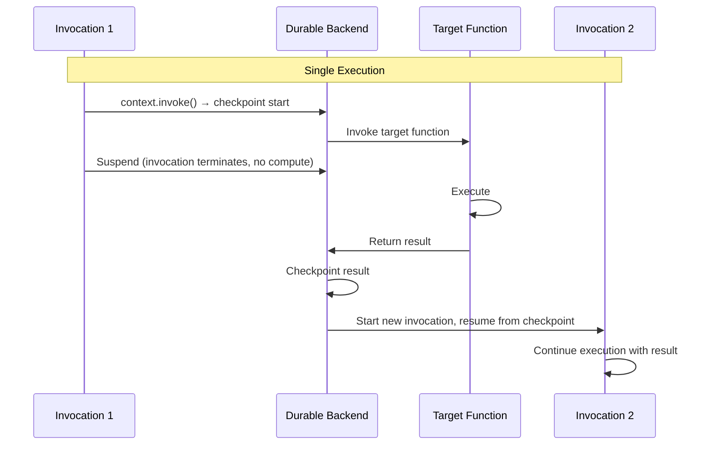

# Invoke operations

## Invoke other Lambda functions durably

The invoke operation calls another Lambda function and waits for its result. When you
call `context.invoke()`, the SDK checkpoints the start of the operation and suspends the
calling function. The durable functions backend invokes the target function. The calling
function does not consume compute while waiting for the result. When the target function
completes, the backend checkpoints the result and then starts a new invocation to resume
execution.

You can invoke both durable functions and standard on-demand Lambda functions.

!!! note

    `context.invoke()` is a durable functions operation that invokes a Lambda function on
    your behalf. It is distinct from the
    [Lambda Invoke API](https://docs.aws.amazon.com/lambda/latest/api/API_Invoke.html),
    which invokes a function directly. `context.invoke()` suspends the calling function
    entirely and resumes it in a new invocation when the result is ready.

## Invoke lifecycle



- **Function** The durable Lambda function. This contains your code.
- **Target Function** The Lambda function targetted by the durable invoke.
- **Execution** The complete end-to-end lifecycle of a durable function, spanning
    potentially multiple invocations.
- **Invocation** A single Lambda invocation within the execution. The invocation
    terminates at the durable invoke operation. The backend starts a new invocation when
    the target function completes, and
    [replays](../../getting-started/key-concepts/#replay) to resume at the invoke point
    with the result.

## Invoke walkthrough

=== "TypeScript"

    ```typescript
    --8<-- "examples/typescript/operations/invoke/process-order.ts"
    ```

=== "Python"

    ```python
    --8<-- "examples/python/operations/invoke/process-order.py"
    ```

=== "Java"

    ```java
    --8<-- "examples/java/operations/invoke/process-order.java"
    ```

When this function runs:

1. The SDK checkpoints the first invoke operation's start and triggers
    `validate-order-function`
2. The calling function suspends until the validation result is available
3. The backend checkpoints the invoke's result and reinvokes the calling function
4. Execution resumes with the validation result
5. The SDK checkpoints the second invoke's start and triggers
    `payment-processor-function`
6. The calling function suspends again until the payment result is available

## Method signature

### invoke

=== "TypeScript"

    ```typescript
    --8<-- "examples/typescript/operations/invoke/invoke-method-signature.ts"
    ```

    **Parameters:**

    - `name` (optional) A name for the invoke operation. Pass `undefined` to omit.
    - `funcId` (required) The function ID or ARN. An alias or version qualifier is required
        for durable functions. On-demand functions do not require a qualifier.
    - `input` (optional) The payload to send to the invoked function.
    - `config` (optional) An `InvokeConfig` object.

    **Returns:** `DurablePromise<TOutput>`. Use `await` to get the result.

    **Throws:** `InvokeError` if the invoked function fails or times out.

=== "Python"

    ```python
    --8<-- "examples/python/operations/invoke/invoke-method-signature.py"
    ```

    **Parameters:**

    - `function_name` (required) The function name or ARN. An alias or version qualifier is
        required for durable functions. On-demand functions do not require a qualifier.
    - `payload` (required) The payload to send to the invoked function.
    - `name` (optional) A name for the invoke operation.
    - `config` (optional) An `InvokeConfig` object.

    **Returns:** `R`, the return value of the invoked function.

    **Raises:** `CallableRuntimeError` if the invoked function fails or times out.

=== "Java"

    ```java
    --8<-- "examples/java/operations/invoke/invoke-method-signature.java"
    ```

    **Parameters:**

    - `name` (required) A nullable name for the invoke operation.
    - `functionName` (required) The function name or ARN. An alias or version qualifier is
        required for durable functions. On-demand functions do not require a qualifier.
    - `payload` (required) The payload to send to the invoked function.
    - `resultType` (required) The `Class<T>` or `TypeToken<T>` for deserialization.
    - `config` (optional) An `InvokeConfig` object.

    **Returns:** `T` (sync) or `DurableFuture<T>` (async via `invokeAsync()`).

    **Throws:**

    - `InvokeFailedException` if the invoked function fails.
    - `InvokeTimedOutException` if the invocation times out (Python only, via
    - `InvokeConfig.timeout`). `InvokeStoppedException` if the invocation was stopped.

### InvokeConfig

=== "TypeScript"

    ```typescript
    interface InvokeConfig<I, O> {
      payloadSerdes?: Serdes<I>;
      resultSerdes?: Serdes<O>;
      tenantId?: string;
    }
    ```

    **Parameters:**

    - `payloadSerdes` (optional) Custom `Serdes<I>` for the payload sent to the invoked
        function. Defaults to JSON serialization.
    - `resultSerdes` (optional) Custom `Serdes<O>` for the result returned from the invoked
        function. Defaults to JSON serialization.
    - `tenantId` (optional) Tenant identifier for multi-tenant isolation.

=== "Python"

    ```python
    @dataclass(frozen=True)
    class InvokeConfig(Generic[P, R]):
        serdes_payload: SerDes[P] | None = None
        serdes_result: SerDes[R] | None = None
        tenant_id: str | None = None
    ```

    **Parameters:**

    - `serdes_payload` (optional) Custom `SerDes` for the payload. Defaults to JSON
        serialization.
    - `serdes_result` (optional) Custom `SerDes` for the result. Defaults to JSON
        serialization.
    - `tenant_id` (optional) Tenant identifier for multi-tenant isolation.

=== "Java"

    ```java
    InvokeConfig.builder()
        .payloadSerDes(SerDes)  // optional
        .serDes(SerDes)         // optional, sets result SerDes
        .tenantId(String)       // optional
        .build()
    ```

    **Parameters:**

    - `payloadSerDes` (optional) Custom `SerDes` for the payload. Defaults to JSON
        serialization.
    - `serDes` (optional) Custom `SerDes` for the result. Defaults to JSON serialization.
    - `tenantId` (optional) Tenant identifier for multi-tenant isolation.

## Naming invoke operations

Name invoke operations to make them easier to identify in logs and tests. You can use
names to describe what the invocation does rather than which function it calls.

=== "TypeScript"

    The name is the first argument. Pass `undefined` to omit it.

=== "Python"

    Pass `name` as a keyword argument. If omitted, the operation has no name in logs.

=== "Java"

    The name is always the first argument. Pass `null` to omit it.

## Configuration

Configure invoke behavior using `InvokeConfig`:

=== "TypeScript"

    ```typescript
    --8<-- "examples/typescript/operations/invoke/invoke-with-config.ts"
    ```

=== "Python"

    ```python
    --8<-- "examples/python/operations/invoke/invoke-with-config.py"
    ```

=== "Java"

    ```java
    --8<-- "examples/java/operations/invoke/invoke-with-config.java"
    ```

## Error handling

Errors from the invoked function propagate to the calling function. Catch them to handle
failures without letting them terminate the calling function.

=== "TypeScript"

    ```typescript
    --8<-- "examples/typescript/operations/invoke/handle-invocation-error.ts"
    ```

=== "Python"

    ```python
    --8<-- "examples/python/operations/invoke/handle-invocation-error.py"
    ```

=== "Java"

    ```java
    --8<-- "examples/java/operations/invoke/handle-invocation-error.java"
    ```

Java exposes separate exception types for different failure modes:
`InvokeFailedException` for function errors, `InvokeTimedOutException` for timeouts
(Python only), and `InvokeStoppedException` when the invocation was stopped. All extend
`InvokeException`.

## See also

- [Callback](callback.md) Wait for callback response from an external system
- [Child contexts](child-context.md) Group operations
- [Parallel operations](parallel.md) Execute operations concurrently
- [Map operations](map.md) Run operation for each item in a collection
