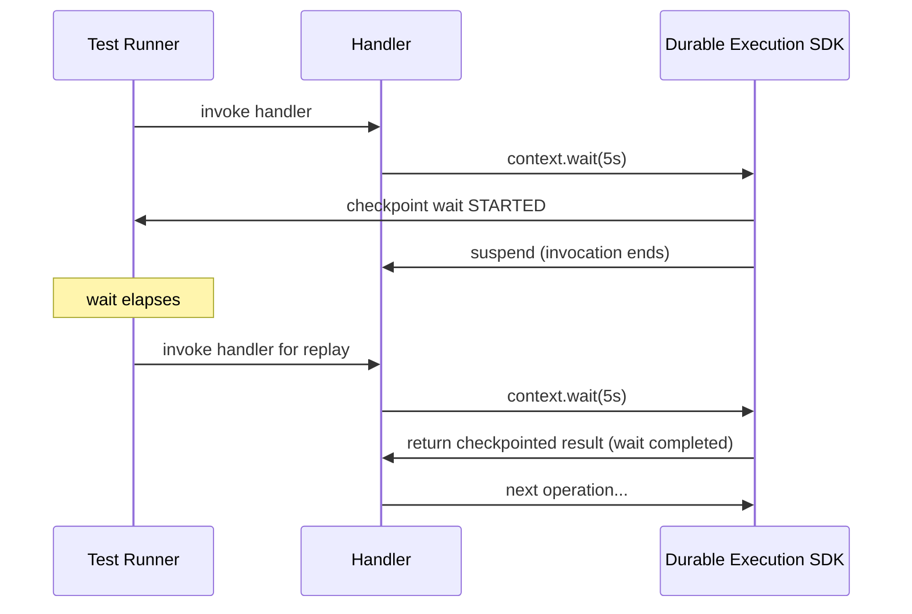

# Test Runner

The testing SDK provides a local and a cloud runner. These run equivalent logic to the
actual backend. Each runner can start a durable execution and replay it over multiple
invocations. Both share the same interface, so you write your tests once and run them
either locally or against a deployed function.

## Test replay and checkpointing

The runner intercepts checkpoint calls from the SDK and controls when to reinvoke the
handler for replay. When a step completes, the SDK checkpoints the result to the
runner's store. On a durable wait operation, the current invocation ends and the runner
invokes the handler again when the wait is over. On replay, the SDK returns checkpointed
results for completed operations without re-executing them, until it reaches new work.

## Test runner

### Local runner

The Durable Execution Local Test Runner runs your handler in-process against an
in-memory checkpoint store. It requires no AWS credentials, no deployment, and no
containers. Use it for unit tests and CI.

See [Authoring](authoring.md) for setup and usage.

### Cloud runner

The Durable Execution Cloud Test Runner invokes a deployed Lambda function, polls for
completion, and retrieves the full operation history for assertions. Use it to validate
deployment, IAM permissions, and actual service integrations.

Because both runners share the same interface, the tests you [author](authoring.md) for
the local runner run unchanged against the cloud runner.

See [Cloud Runner](cloud-runner.md) for setup and usage.

## SAM CLI

Use SAM CLI to test durable functions without writing test code. Use it for manual
invocation, smoke testing, and catching runtime issues that the in-process runner cannot
surface, such as packaging problems and environment variable configuration.

See [SAM CLI](sam-cli.md) for setup and usage.

### Local invoke

`sam local invoke` runs your function inside a container that matches the Lambda
runtime. It handles checkpointing and replay automatically. You do not need to deploy to
AWS.

### Remote invoke

`sam remote invoke` invokes a deployed Lambda function in the cloud. Use it for quick
manual invocation and smoke testing after deployment.
